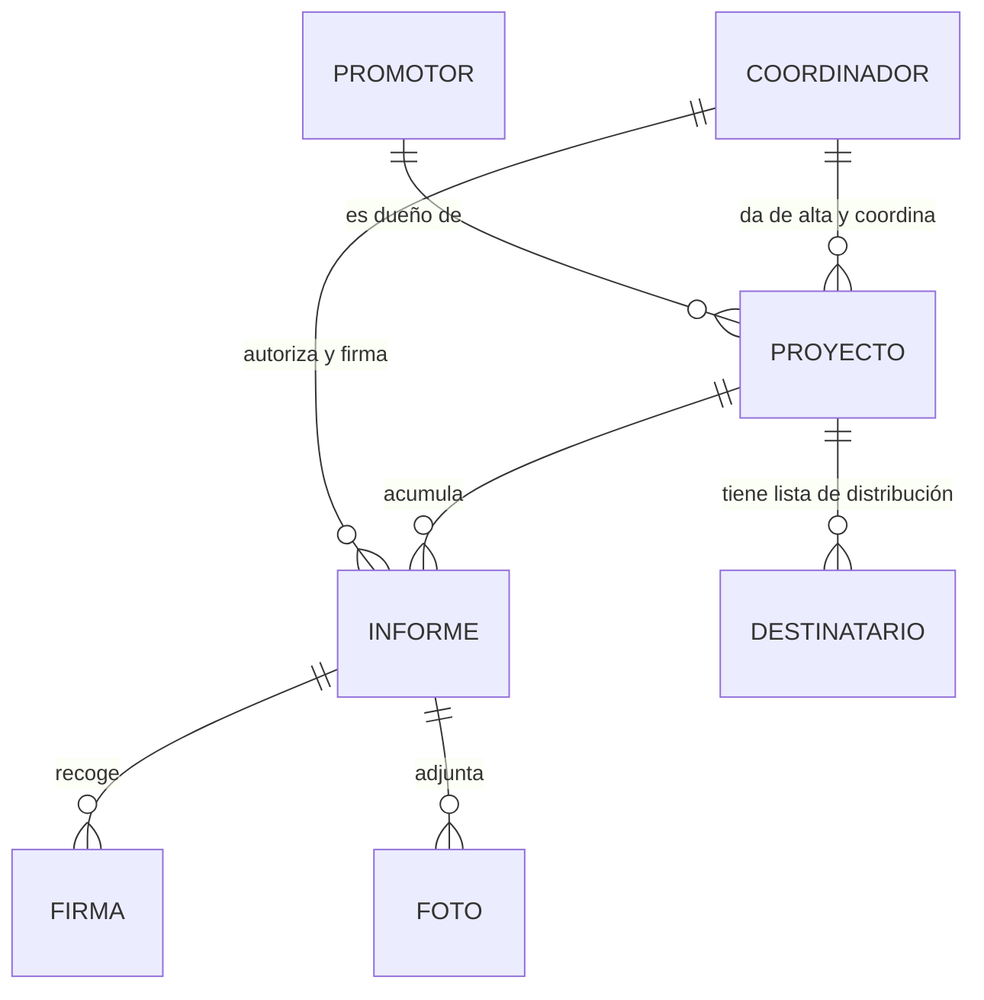

# Domain model

> `validated: false` — distilled from the 2026-06-16 meeting + public research (RD 1627/1997, colegio templates, SIAC). Confirm against the stakeholder's real report and the SIAC form before treating as settled. See [[legal-context]] for sources.

The four core entities and how they relate. Detail per entity lives in the `entity-*` files; this file holds the overview, the relationships, and cross-entity rules.

## The four entities

- **[[entity-coordinador]]** — the only operator of the system. The Coordinador de Seguridad y Salud en fase de ejecución who runs the visits and authors the reports. Carries the professional registry data that gives reports legal weight.
- **[[entity-promotor]]** — the client / owner of the obra. Principal addressee of every report; does not sign. Its data is captured at alta de obra.
- **[[entity-proyecto]]** — the construction work (obra). The central resource everything hangs off: it has one promotor, one coordinator, a distribution list, and many reports.
- **[[entity-informe]]** — the daily (or weekly) site-visit report. The unit of work the product produces.

## Relationships

Cardinalities, in words: a coordinator registers and coordinates many proyectos; each proyecto has exactly one promotor and (for phase 1) one coordinator; a proyecto accumulates many informes over its life and carries one distribution list of recipients; each informe collects one or more signatures and zero-or-more photos, and is authored by the coordinator.

**Distribution list (recipients)** is modeled as a sub-collection of the proyecto rather than a top-level entity in phase 1 — it's a list of email contacts with a role label (promotor, dirección facultativa, técnico PRL, contratista principal, subcontrata). See [[entity-proyecto#distribution-list]].

## Cross-entity rules

- **A proyecto cannot start without an approved Plan de Seguridad y Salud and a designated coordinator.** RD 1627/1997: the project carries an *estudio* de seguridad; the winning contractor writes a *plan* based on it; the coordinator reviews and approves it; only then can the centro de trabajo open and work begin. The product's alta-de-obra should reflect that the coordinator is already designated. See [[entity-proyecto#lifecycle]] and [[legal-context]].
- **The coordinator's registry number is mandatory on every report's signature** — specifically the Comunidad de Madrid IRSST registration number (e.g. 3306), *not* the colegiado number. See [[entity-coordinador#registry]].
- **Recipients are addressees, not users.** Only the coordinator operates the system in phase 1. The promotor receives but does not sign; site managers who attend the visit sign; subcontractors sign only when flagged for non-compliance. See [[entity-informe#signatures]].
- **Cross-entity references by ID.** An informe references its proyecto by id; a proyecto references its promotor and coordinator by id. Keeps the local data model clean and makes a future backend swap (phase 2) a smaller change.

## Local persistence shape (phase 1)

Async storage on device. Provisional top-level collections: `coordinador` (single profile), `proyectos`, `informes`, with recipients and signatures/photos nested under their parent. Photos stored as device blobs/base64 with size reduction on capture (replacing today's manual iPhone→WhatsApp→Android shrink trick). This is a sketch, not a schema — finalize when implementation starts.
