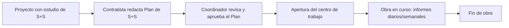

# Entity — Proyecto (obra)

> `validated: false` — confirm fields against the "formulario de obra nueva" / alta de obra the stakeholder uses.

The **proyecto** (the obra) is the central resource: everything else hangs off it. It has one [[entity-promotor|promotor]], one [[entity-coordinador|coordinator]] (phase 1), a distribution list of recipients, and accumulates many [[entity-informe|informes]] over its life.

## Alta de obra (formulario de obra nueva) {#alta-de-obra}

The coordinator opens the proyecto via a "formulario de obra nueva." He **selects an already-registered [[entity-promotor|promotor]]** (registered in a prior step — see [[decisions#d5-promotor-first-class]]), enters the project's identifying data, and subscribes the distribution list. The proyecto links the promotor by id rather than capturing its data inline.

| Field (provisional) | Notes |
|---|---|
| Código de obra | Identifier (the stakeholder referenced "un código X"). |
| Promotor | Reference (by id) to an existing [[entity-promotor]], selected — not entered — here. |
| Descripción del proyecto | What the obra is. |
| Plazo de ejecución | Start/end dates. |
| Monto / presupuesto | Contract value. |
| Coordinador designado | The operator; designation is what lets the obra legally start. |
| Frecuencia de visita | Daily / weekly (drives the informe cadence — see [[entity-informe]]). |
| Lista de distribución | Recipients — see [[#distribution-list]]. |

**OPEN:** the exact field set of the formulario de obra nueva is not confirmed; depends on the stakeholder's template / the SIAC form. See [[#open]].

## Distribution list {#distribution-list}

A sub-collection of the proyecto: the contacts who receive every informe for this obra. Each entry is an email plus a role label. Subscribed once at alta de obra and reused for every report.

Roles: **promotor** (principal addressee), **dirección facultativa / dirección de obra**, **técnico de PRL**, **contratista principal** (jefe de obra, jefe de producción, técnico de PRL de la contrata, encargado), and **subcontratas** — the last included on a given report only when flagged for non-compliance that day. See [[entity-informe#recipients-and-signatures]].

## Lifecycle {#lifecycle}

RD 1627/1997: a construction work needs a project; the project contains an *estudio* de seguridad y salud; the contractor produces a *plan* from it; the coordinator approves the plan; only then can the centro de trabajo open and work start. The product's scope (phase 1) is the "obra en curso" stage — the recurring informes — but alta de obra should capture enough to anchor a report to its obra.

## Open questions {#open}

- Confirm the formulario de obra nueva field set and the "código de obra" format.
- Whether the product should also record the Plan de Seguridad approval (likely phase 3, alongside actas — see [[roadmap#phase-3-adjacent-documents]]).
