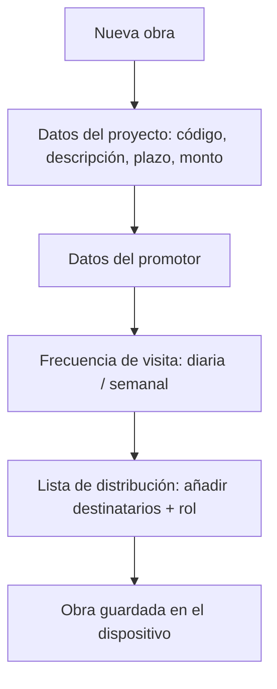
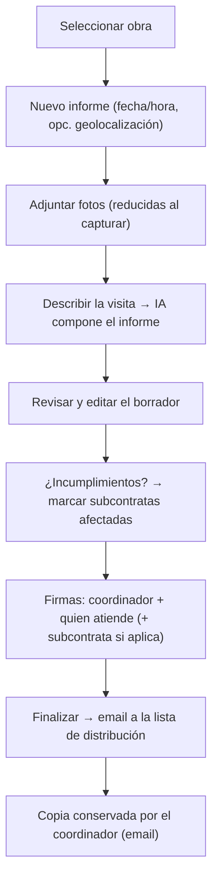

# Flows

> `validated: false` — first sketch from the meeting; refine into wireframes once the stakeholder's example report and the SIAC screens arrive.

The two phase-1 flows: registering an obra, and producing a daily report. Both are operated solely by the [[entity-coordinador|coordinator]].

## One-time: coordinator profile

On first use, the coordinator sets up his profile — identity, CAM registry number ([[entity-coordinador#registry]]), email/firm, and captured signature. Auto-populates every later report. One profile per device (phase 1).

## Alta de obra {#alta-de-obra}

The coordinator opens the obra and enters the project + promotor data (supplied by the promotor) and subscribes the distribution list once. See [[entity-proyecto#alta-de-obra]]. Stored locally.

## Relleno del informe {#relleno-del-informe}

The core daily loop. AI assistance sits at step D; everything around it is data capture and distribution. See [[entity-informe]] for the field detail and signature rules.

## What's explicitly NOT in these flows (phase 1)

- No shared repository or cross-device history — the durable copy is the email ([[decisions#d1-local-only-pwa]]).
- No promotor login — recipients receive email, they don't enter the app ([[entity-promotor]]).
- No actas de reunión / libro de incidencias — phase 3 ([[roadmap#phase-3-adjacent-documents]]).
- No monthly-summary generation yet — later feature.

## Open questions {#open}

- Whether AI filling is a free-text chat or a guided question set (affects the step-D UX).
- Whether geolocation is captured at step B (SIAC does — [[reference-siac]]).
- Offline behavior: a site may have no signal; capture must work offline and email on reconnect (fits the local-PWA model well).
