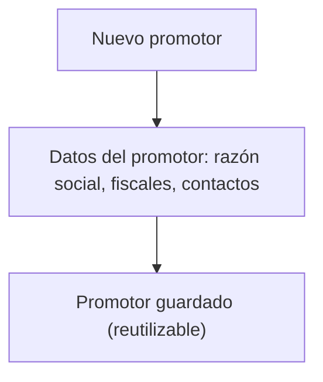
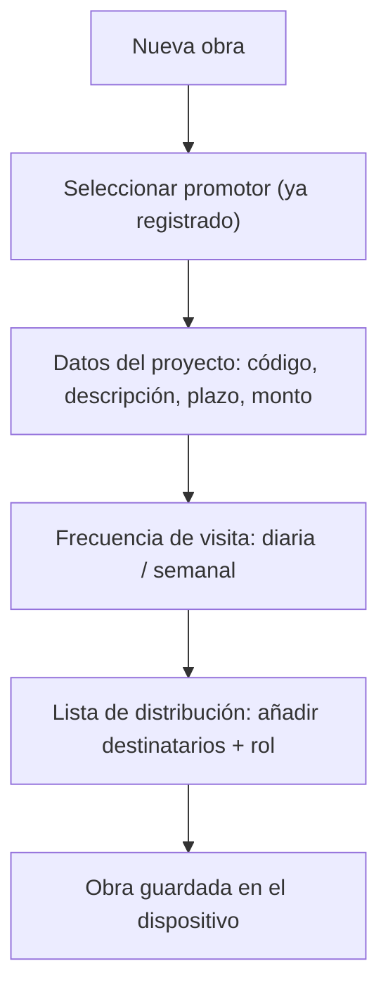
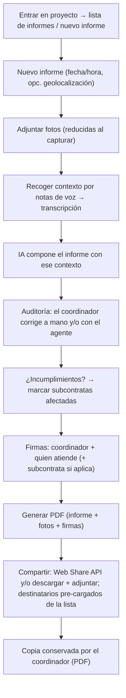

# Flows

> `validated: false` — first sketch from the meeting; refine into wireframes once the stakeholder's example report and the SIAC screens arrive.

The phase-1 flows, in order: set up the profile, register a promotor, create a proyecto, then produce reports inside it. All operated solely by the [[entity-coordinador|coordinator]]. Registration is a **local profile — no account, no login, no auth** ([[active-context]]).

## One-time: coordinator profile {#one-time-coordinator-profile}

On first use, the coordinator sets up his profile — identity, CAM registry number ([[entity-coordinador#registry]]), email/firm, and captured signature. Auto-populates every later report. One profile per device (phase 1). No authentication: the data is local to the device.

## Alta de promotor {#alta-de-promotor}

Before any obra, the coordinator registers the promotor(es) as standalone records ([[decisions#d5-promotor-first-class]]). A promotor is reused across all its obras.

## Alta de obra {#alta-de-obra}

The coordinator picks an existing promotor, enters the project data, and subscribes the distribution list once. See [[entity-proyecto#alta-de-obra]]. Stored locally.

## Relleno del informe {#relleno-del-informe}

The core daily loop. Context is gathered by **voice notes transcribed to text** (D), which feed the **OpenAI** filling (E); then a dedicated **audit phase** (F) where the coordinator corrects manually and/or with the agent. Transcription and filling are online-only ([[decisions#d4-architecture]]). The deliverable is a **client-generated PDF**, shared by the coordinator (no programmatic email). See [[entity-informe]] for field detail and signature rules.

## What's explicitly NOT in these flows (phase 1)

- No shared repository or cross-device history — the durable copy is the emitted PDF ([[decisions#d1-local-only-pwa]]).
- No promotor login — recipients receive the PDF, they don't enter the app ([[entity-promotor]]).
- No programmatic email send — `mailto:` can't attach; the coordinator shares the PDF himself ([[decisions#d4-architecture]]).
- No actas de reunión / libro de incidencias — phase 3 ([[roadmap#phase-3-adjacent-documents]]).
- No monthly-summary generation yet — depends on the fecha-vs-mes question ([[stakeholder-questions#q1-fecha-vs-mes]]).

## Open questions {#open}

- The informe **por fecha vs por mes** disparity — affects whether the "nuevo informe" step branches by type. See [[stakeholder-questions#q1-fecha-vs-mes]].
- Whether AI filling is free-text chat or a guided question set (affects step E UX).
- Whether geolocation is captured at the new-report step (SIAC does — [[reference-siac]]).
- Offline behavior: a site may have no signal. Data **capture** must work offline; **transcription + AI filling are online-only**, so those steps defer until reconnect.
