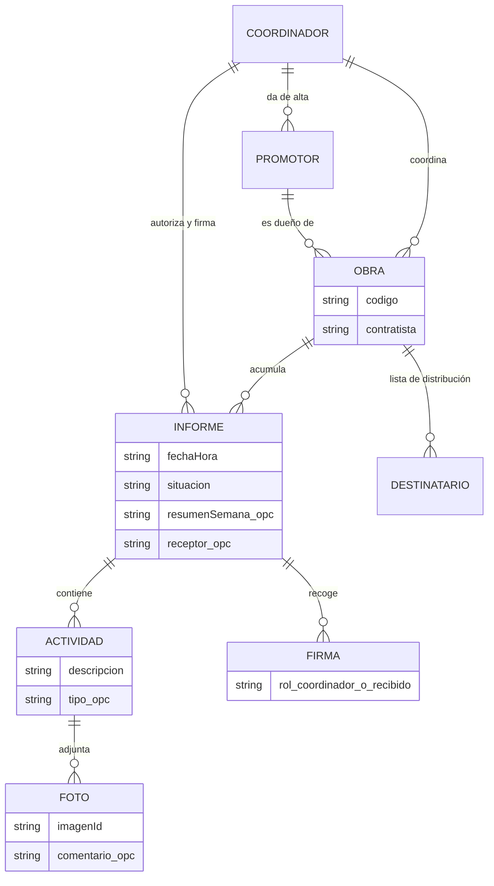

# Radiografía — Informe v2

> Para **Josune** (léelo como humano) y para **su Claude** (úsalo como contexto). Es la foto completa de qué vamos a construir en el rework del informe y —más importante— **por qué**. No es un ticket: es el mapa. Los tickets/fases los planteamos juntos **después de tu visto bueno**. Fuente formal: [[decisions#d9-informe-v2]] y [[entity-informe]]. Nace de tu propuesta (`propuesta-informe-estructura-real.md`) + 4 afinados que le suman visión de futuro.

## 1. La foto en una frase

El informe deja de ser "un texto + fotos + incumplimientos" y pasa a ser **una situación general + una lista de actividades, donde cada actividad lleva su descripción y sus fotos (con comentario opcional)**. Una incidencia no es nada especial: es una actividad más.

## 2. El plan, en cristiano

Lo que propusiste se queda casi entero. Estos son los cambios y el porqué de cada uno:

- **Situación → actividades → fotos.** Como en los 8 informes reales. La "actividad" es la pieza que se repite; se añaden libremente.
- **Las incidencias son una actividad más** (tu idea, y es la correcta). Le añadimos solo una etiqueta **opcional e invisible por defecto** (`tipo`: normal/incidencia) — no molesta en pantalla, pero deja la puerta abierta a contarlas/analizarlas el día de mañana (ver §6).
- **Fuera el paso "Incumplimientos" y fuera la regla "la subcontrata firma".** Tal cual propusiste: no existen en los informes reales.
- **Firmas:** coordinador (**obligatoria**) + "recibido por" (**opcional**). Nada más.
- **Comentario de foto: opcional.** Nunca bloquea nada.
- **El "recibido por" vive en el informe** (cambia cada visita); el **contratista, en la obra** (es estable).
- **El PDF calca el informe real** (cabecera en tabla, 2 fotos por fila, comentarios en negrita…), pero se genera desde una **plantilla parametrizable**, no con el formato incrustado a fuego (así mañana cabe otro organismo).
- **El asistente pasa de 5 pasos a 3:** Datos de la visita → Situación y actividades → Firmas.

Se **elimina**: el paso Incumplimientos, el campo `contenido`, `firmantes.ts`/`firmantesRequeridos`, y sus tests. Tranquila con esto: como F1 guarda todo en el dispositivo y aún no hay datos reales, **no hay nada que migrar** — se descartan los borradores de prueba y ya.

## 3. El diagrama, explicado

Cómo leerlo: el **Coordinador** es el único que usa la app — da de alta promotores y obras, escribe los informes y los firma. Una **Obra** pertenece a un promotor y acumula muchos **Informes** (más su lista de destinatarios). Un **Informe** contiene **Actividades**; cada actividad adjunta **Fotos**. Las **Firmas** son del informe. Recordatorio: en pantalla decimos "obra"; en el código la entidad se llama `Proyecto`.

## 4. La parte técnica robusta — "hablar como con un backend"

**La buena noticia: ya estás al ~70%.** El código que montaste ya tiene lo difícil: los **puertos son asíncronos** (`guardar(): Promise<void>`, `obtenerPorId(): Promise<…>`), hay **inyección de dependencias** en `composition-root.ts`, y hay **fakes en memoria** para los tests. Es decir, la app ya "espera" como si hablara con un servidor, aunque por debajo guarde en el dispositivo. El día del backend, se cambian los adaptadores y ni el dominio ni las pantallas se enteran.

**Lo que falta para dejarlo redondo (4 costuras, en el hito de persistencia, DESPUÉS del cambio de modelo):**

1. **Capa DTO ↔ dominio.** Hoy el adaptador guarda el objeto de dominio tal cual. Un backend intercambia **JSON plano (DTO)**. Añadir `toDTO`/`fromDTO` por agregado desacopla el formato de transporte del dominio → el DTO ya es el contrato de la futura API.
2. **Almacén de imágenes aparte (`MediaStore`).** Hoy las fotos van en base64 **dentro** del informe: reescribe el documento entero al guardar y peta la cuota. Sácalas a un almacén propio; el informe referencia la foto por `id`. Es exactamente la forma del "subir imagen → recibir id" de un backend, y de paso arregla rendimiento y cuota hoy.
3. **Read-models de lista.** Listar informes no debería deserializar megas de fotos: devolver un **resumen ligero** (id, fecha, estado, nº de actividades/fotos) para las listas, y el detalle completo solo al abrir uno.
4. **Contrato explícito** (media página): ids en cliente (UUID), tiempos en ISO, errores como `Result`, y un `schemaVersion` en el DTO para poder migrar el día que haga falta.

**Regla de oro (para ti y para tu Claude):** la UI **nunca** toca localForage ni un DTO; solo llama a casos de uso que devuelven objetos de dominio. Toda volatilidad (guardar, imágenes, PDF, compartir, IA) vive **detrás de un puerto**.

## 5. La radiografía — qué DEBE ser esto (los porqués de raíz)

Para que decidas bien cuando estés en el detalle, ten presente el "por qué" profundo de cada afinado (no es capricho):

- **`tipo` en la actividad = no tirar el valor del producto.** Lo que a la larga hace valioso esto —y lo que un promotor pagaría— no es un PDF bonito, es la **trazabilidad estructurada** de la seguridad. Si la incidencia se disuelve en prosa, perdemos esa señal. Un campo opcional la conserva sin coste de UI.
- **Fotos fuera del documento = rendimiento y futuro.** No es purismo: es evitar que el informe pese megas y que el backend del mañana sea un dolor.
- **Receptor por informe = el modelo no pelea con la realidad.** Meter un dato que cambia cada visita en una entidad estable se paga después.
- **PDF por plantilla = no casarnos con un cliente.** Calcamos el de ahora, pero parametrizable.
- **Producto hoy vs mañana:** hoy validamos esto como **la herramienta del coordinador**. Mañana **puede** convertirse en un sistema de evidencia para el promotor. No hay que decidirlo ahora; solo **no cerrar esa puerta** por accidente (por eso §5 punto 1).

## 6. Cómo trabajaremos

- **Secuencia:** primero el **cambio de modelo del informe** (esto), y **después** un hito propio de **persistencia** (las 4 costuras de §4). No mezclar dos cambios grandes a la vez.
- **Ritmo de siempre:** empiezas por actualizar la KB y guardar los informes de referencia, y luego pieza a pieza con tu Claude, proponiendo plan antes de tocar código.
- **Tu turno primero:** revisa esta radiografía y el mensaje de visto bueno. Si algo no te cuadra o ves mejor forma, **dilo** — tu criterio ya ha demostrado que suma. Con tu OK, **planteamos las fases concretas** para ejecutar.

## 7. Lo que NO cambia (tranquilidad)

Perfil, promotores, alta de obra (salvo el `contratista` en cabecera), la mecánica de generar PDF y compartir, el offline, la navegación, el despliegue en Vercel, y **toda la arquitectura hexagonal** (puertos, casos de uso, composition root). Esto es evolución, no demolición.

## 8. Para tu Claude — contexto a leer antes de ejecutar

Cuando arranquéis, que lea (además de este doc): [[entity-informe]] (modelo v2, la fuente viva), [[decisions#d9-informe-v2]] (la decisión y sus porqués), [[design-system]] (tokens/pantallas), [[gotchas]] (trampas), y la propuesta original `propuesta-informe-estructura-real.md`. Y que respete el [[working-preferences|contrato de trabajo]]: español llano en la UI, presbicia, y proponer plan antes de escribir código.
